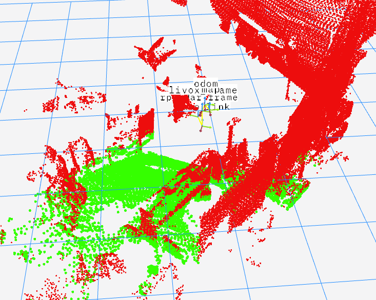
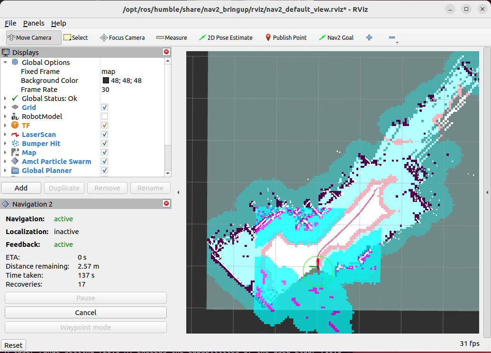

# CSU-RM-Sentry

中南大学FYT机器人战队哨兵机器人上位机算法（定位与导航部分）。基于点云分割和Nav2导航框架，导航过程中上坡

文件的命名参考了rm_vision项目

**作者: 邹承甫** 

**找我交流: 3548054568(QQ)**

**思路介绍**

- 使用fast-lio获得3D里程计
- 使用icp-localization进行重定位
- 使用linefit_ground_segmentation对MID360的点云进行分割，分割为地面和障碍物
- 将障碍物的点云从PointCloud2压缩为LaserScan，输入Nav2
- 用Nav2进行导航

|地面分割效果图|导航功能像Nav2一样实现|
|-|-|
|||

## 1. 框架

- **rm_bringup** (启动相机驱动，串口驱动，自瞄程序和robot_state_publisher，参考rm_vision项目)
- **rm_interfaces** (自定义msg和srv)
- **rm_description** (机器人的urdf)
- **rm_autoaim** (自瞄算法，基于陈君rm_vision项目做了一点修改)
- **rm_camera_driver** (工业相机驱动)
- **rm_serial_driver** (和下位机进行通信的串口驱动程序，参考rmoss开源项目)
- **rm_localization** (定位算法)
    - [**fast_lio**](https://github.com/Ericsii/FAST_LIO) (提供里程计)
    - [**icp_localization**](https://github.com/leggedrobotics/icp_localization) (提供map到odom的坐标变换)
- **rm_navigation** (Nav2的launch和参数)
- **rm_perception** (处理传感器数据的一些算法)
    - [**imu_complementary_filter**](https://github.com/CCNYRoboticsLab/imu_tools) (IMU滤波)
    - [**linefit_ground_segmentation**](https://github.com/lorenwel/linefit_ground_segmentation) (点云分割)
    - [**pointcloud_to_laserscan**](https://github.com/ros-perception/pointcloud_to_laserscan) (将PointCloud2转换为LaserScan)
- **rm_sensors** (传感器的驱动)
    - [**livox_ros_driver2**](https://github.com/Livox-SDK/livox_ros_driver2) (MID360驱动，我们的MID360安装在机器人脑门上，只能获得正前方的点云)
    - [**rplidar_ros2**](https://github.com/Slamtec/rplidar_ros) (可选，思岚2d雷达，安装在背面，只用来更新local_costmap，不参与建图，如果不考虑后退的话可以去掉)


```sh
src
|
├── rm_bringup                
|
├── rm_interfaces
|
├── rm_description           
|
├── rm_autoaim                
|
├── rm_camera_driver          
|
├── rm_serial_driver          
|
├── rm_localization           
│   ├── fast_lio              
│   └── icp_localization_ros2 
|
├── rm_navigation
|
├── rm_perception
│   ├── imu_complementary_filter
│   ├── linefit_ground_segementation_ros2
│   └── pointcloud_to_laserscan
|
└── rm_sensors
    ├── livox_ros_driver2
    └── rplidar_ros(optional)
```

## 2. 安装

安装ros-humble-desktop-full，参考 [ROS2官方文档](https://docs.ros.org/en/humble/index.html)

安装Livox-SDK2，参考 [LIVOX-SDK2官方仓库](https://github.com/Livox-SDK/Livox-SDK2)

克隆仓库到本地

```bash
git clone https://github.com/CSU-FYT-Vision/CSU-RM-Sentry && cd CSU-RM-Sentry
```

安装依赖

```bash
sudo apt-get install -y  libpcl-ros-dev
rosdep install --from-paths src --ignore-src -r -y
```

编译
```bash
colcon build --symlink-install
```

运行
```bash
# 建图
./mapping.sh
# 导航
./nav.sh
```

## 2. 依赖

- **系统**
  - Ubuntu 22.04
  - ROS Humble (desktop-full)
- **库**
  - [LIVOX-SDK2](https://github.com/Livox-SDK/Livox-SDK2)
  - libpcl-ros-dev
  - eigen、pcl、opoencv、ceres等

## 3. 硬件

- **Mini PC** 
    - cpu: AMD Ryzen R7 7735HS 
    - ram: 16GB DDR5
- **传感器**
    - Livox MID-360 
    - 大恒水星工业相机
    - rplidar A2M7 (只是辅助) 
